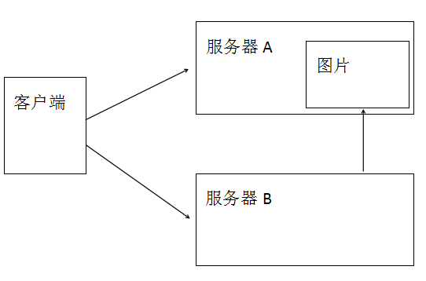
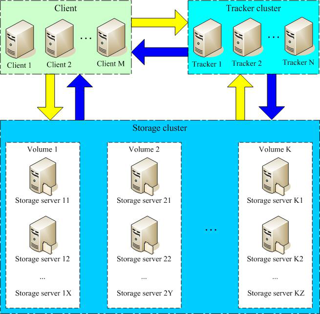

# 【FastDFS+Nginx】

## 主要内容

1. 项目架构的改变

2. 分布式文件系统概述

3. FastDFS简介

4. FastDFS架构

5. 文件上传流程

6. FastDFS安装

7. Fastdfs-java-client

8. 文件下载

9. Nginx简介

10. Nginx安装

11. KindEditor使用

## 学习目标

| 知识点                 | 要求   |
| ------------------- | ---- |
| 项目架构的改变             | 掌握   |
| 分布式文件系统概述           | 掌握   |
| FastDFS简介           | 掌握   |
| FastDFS架构           | 掌握   |
| 文件上传流程              | 掌握   |
| FastDFS安装           | 了解   |
| fastdfs-java-client | 掌握   |
| 文件下载                | 掌握   |
| Nginx简介             | 掌握   |
| Nginx安装             | 了解   |
| KindEditor使用        | 掌握   |

### 一、项目架构的改变





​        上一次课我们采用的上面的方式进行图片存储。图片在哪个项目中上传的图片就存储到哪个项目所在的服务器。其他项目模块通过HTTP请求进行获取图片。

​        虽然说可以实现不同模块之间图片的访问，但是问题也很明显，包含如下问题：

- 图片存储过于分散。
- 图片多的服务器压力比较大，可能会影响其他功能。
- 存储到项目路径中，重启会丢失。存储到外部文件中，I/O操作性能低。


​        针对上面问题可以搭建单独的图片服务器，专门做图片存储及图片访问的。而想要搭建图片服务器就需要应用图片存储技术/工具。


 

### 二、分布式文件系统概述

#### 1     分类

##### 1.1   通用分布式文件系统

​	和传统的本地文件系统（如ext3、NTFS等）相对应。典型代表：lustre、MooseFS

###### 1.1.1    优点

​	标准文件系统操作方式，对开发者门槛较低

###### 1.1.2    缺点

​	系统复杂性较高，需要支持若干标准的文件操作，如：目录结构、文件读写权限、文件锁等。复杂性更高

​	系统整体性能有所降低，因为要支持POSIX标准（表示[可移植操作系统接口](https://baike.baidu.com/item/可移植操作系统接口/12718298)（Portable Operating System Interface of UNIX），POSIX标准定义了操作系统应该为应用程序提供的接口标准）

##### 1.2   专用分布式文件系统

​	基于google File System的思想，文件上传后不能修改。需要使用专有API对文件进行访问，也可称作分布式文件存储服务。典型代表：MogileFS、FastDFS、TFS。

###### 1.2.1    优点

​	系统复杂性较低，不需要支持若干标准的文件操作，如：目录结构、文件读写权限、文件锁等，系统比较简洁。

​	系统整体性能较高，因为无需支持POSIX标准，可以省去支持POSIX引入的环节，系统更加高效。

###### 1.2.2    缺点

​	采用专有API，对开发者门槛较高（直接封装成工具类）

#### 2     Google FS 体系结构

##### 2.1    两个角色

​	名字服务器（索引服务器）

​	存储服务器

##### 2.2   架构特点

​	不支持文件修改功能。

​	文件分块存储，需要索引服务器

​	一个文件可以存储多份，一个文件存储到哪些存储服务器，通常采用动态分配的方式。

###  三、FastDFS简介

#### 1     简介

​	FastDFS是一个轻量级的开源分布式文件系统。2008年4月份开始启动。类似google FS的一个轻量级分布式文件系统，纯C实现，支持Linux、FreeBSD、AIX等UNIX系统。

​	主要解决了大容量的文件存储和高并发访问的问题，文件存取时实现了负载均衡。实现了软件方式的磁盘阵列（Redundant Arrays of Independent Drives，RAID），可以使用廉价的IDE（Integrated Drive Electronics）硬盘进行存储。并且支持存储服务器在线扩容。支持相同内容的文件只保存一份，节约磁盘空间。

​	FastDFS只能通过Client API访问，不支持POSIX访问方式。

​	FastDFS特别适合大中型网站使用，用来存储资源文件（如：图片、文档、音频、视频等等）

#### 2     网址

​	FastDFS没有官网。但是作者余庆（happy_fish100）担任chinaunix中FastDFS板块版主。并且会不定期更新板块中内容。

```
http://bbs.chinaunix.net/
```

​	FastDFS软件可以在sourceforge中进行下载，最新版本为5.08

```
https://sourceforge.net/projects/fastdfs/files/
```

###  四、    FastDFS架构

#### 1     架构图





 

#### 2     角色

​	Client：客户端。使用java语言编写的项目属于客户端。

​	Tracker Server：跟踪服务器，主要做调度工作，在访问上起负载均衡的作用。在内存中记录集群中group和storage server的状态信息，是连接Client和Storage server的枢纽。

​	 Storage Server：存储服务器，文件和文件属性（meta data）都保存到存储服务器上

#### 3     架构解读

​	只有两个角色，tracker server和storage server，不需要存储文件索引信息。

​	所有服务器都是对等的，不存在Master-Slave关系。

​	存储服务器采用分组方式，同组内存储服务器上的文件完全相同（RAID 1）。

​	不同组的storage server之间不会相互通信。

​	由storage server主动向tracker server报告状态信息，tracker server之间不会相互通信。

### 五、FastDFS安装

#### 1.安装FastDFS依赖

 	 FastDFS是C语言开发的应用。安装必须使用 make , cmake 和 gcc编译器。

```
# yum install -y make cmake gcc gcc-c++
```

#### 2 上传并解压libfastcommon-master

​	上传libfastcommon-master 到 /usr/local/tmp下。 libfastcommon是从FastDFS和FastDHT中提取出来的公共C函数库

​	解压 libfastcommon-master.zip 由于是zip文件所以要使用 unzip命令

```
# cd /usr/local/tmp
# unzip libfastcommon-master.zip
```

#### 3 编译并安装

​	libfastcommon没有提供make命令安装文件。使用的是shell脚本执行编译和安装。shell脚本为 make.sh

​	进入解压后的文件

```
# cd libfastcommon-master
```

​	编译

```
#./make.sh
```

​	安装	

```
#./make.sh install
```

​	有固定的默认安装位置。在/usr/lib64 和  /usr/include/fastcommon两个目录中

#### 4 创建软连接

​	 因为FastDFS 主程序设置的lib目录是 /usr/local/lib， 所以需要创建软连接

```
# ln -s /user/lib64/libfastcommon.so /usr/local/lib/libfastcommon.so
# ln -s /usr/local/lib64/libfdfsclient.so /usr/local/lib/libfdfsclient.so
```

#### 5 上传并解压FastDFS主程序

​	 上传 FastDFS_v5.08.tar.gz 到 /usr/local/tmp下后解压

```
# cd /usr/local/tmp
# tar zxf FastDFS_v5.08.tar.gz
```

#### 6 编译并安装FastDFS

​	进入到解压后的FastDFS文件中

```
# cd FastDFS
```

​	编译

```
# ./make.sh
```

​	安装

```
# ./make.sh install
```

​	安装后 FastDFS主程序所在的位置是

​	/usr/bin  可执行文件所在的位置

​	/etc/fdfs  配置文件所在的位置

​	/usr/bin  主程序代码所在位置

​	/usr/include/fastdfs 包含一些插件组所在的位置

#### 7 配置tracker

##### 7.1 复制配置文件

​	进入到 /etc/fdfs 中 ， 把tracker配置文件复制一份

```
# cd /etc/fdfs
# cp tracker.conf.sample tracker.conf
```

##### 7.2 创建数据目录

​	创建放置 tracker数据的目录

```
# mkdir -p /usr/local/fastdfs/tracker
```

#####  7.3 修改配置文件

​	修改 tracker.conf 设置 tracker 内容存储目录

```
base_path=/usr/local/fastdfs/tracker
#vim tracker.conf
```

 	默认端口 22122   不需要修改

##### 7.4 启动服务 

```
# service fdfs_trackerd start
```

​	启动成功后， 配置文件中 base_path 指向的目录出现 FastDFS服务相关数据目录(data目录， logs 目录)

##### 7.5 查看服务运行状态

```
# service fdfs_trackerd status
```

​	如果显示 is running 表示正常运行。

##### 7.6 关闭防火墙

```
# service iptables stop
# chkconfig iptables off
```

####  8 配置storage

 	  storage可以和tracker不在同一台服务器上。示例中把storage和tracker安装在同一台服务器上了。

#####     8.1 复制配置文件

​	进入到 /etc/fdfs, 把 storage 配置文件复制一份

```
# cd /etc/fdfs
# cp storage.conf.sample storage.conf
```

#####   8.2 创建目录

​	 创建两个目录， 把base用于存储基础数据和日志，store用于存储上传数据。

```
# mkdir -p /usr/local/fastdfs/storage/base
# mkdir -p /usr/local/fastdfs/storage/store
```

##### 8.3 修改配置文件

​	storage.conf配置文件用于描述存储服务的行为，需要进行下述修改

```
# vim /etc/fdfs/storage.conf
```

​	配置内容如下：

```
base_path=/usr/local/fastdfs/storage/base
store_path0=/usr/local/fastdfs/storage/store
tracker_server=tracker 服务IP：22122
```

​	base_path - 基础路径。用于保存storage server 基础数据内容和日志内容的目录。

​	store_path0 - 存储路径。是用于保存FastDFS中存储文件的目录，就是要创建256*256个子目录的位置。

​	base_path 和 store_path0 可以使用同一个目录。

​	tracker_server - 跟踪服务器位置。就是跟踪服务器的IP和端口。

​	启动服务

```
# service fdfs_storaged start
```

​	启动成功后，配置文件中base_path 指向的目录中出现FastDFS服务相关数据目录（data目录、logs目录）配置文件中的store_path0指向的目录中同样出现FastDFS存储相关数据录（data目录）。其中$store_path0/data/目录中默认创建若干子孙目录（两级目录层级总计256*256个目录），是用于存储具体文件数据的。

​	Storage 服务器启动比较慢，因为第一次启动的时候，需要创建256*256个目录。

​	查看启动状态

```
# service fdfs_storaged status
```

### 六、文件上传流程

#### 1     时序图


### 2     流程说明

1.  客户端访问Tracker
2.  Tracker 返回Storage的ip和端口
3.  客户端直接访问Storage，把文件内容和元数据发送过去。
4.  Storage返回文件存储id。包含了组名和文件名


###  七、Fastdfs-java-client

#### 1     添加依赖

```
<dependencies>
    <dependency>
        <groupId>cn.bestwu</groupId>
        <artifactId>fastdfs-client-java</artifactId>
        <version>1.27</version>
    </dependency>
    <dependency>
        <groupId>org.apache.commons</groupId>
        <artifactId>commons-lang3</artifactId>
        <version>3.4</version>
    </dependency>
</dependencies> `     
```

####  2     编写配置文件

​	文件名：fdfs_client.conf

​	修改成自己的tracker服务器ip

```
connect_timeout = 10
network_timeout = 30
charset = UTF-8
http.tracker_http_port = 8080
tracker_server = 192.168.93.10:22122   
```

#### 3    导入工具类

​	在com.utils.FastDFSClient 下粘贴配置工具类

```
package com.msb.utils;
import java.io.ByteArrayInputStream;
import java.io.File;
import java.io.FileInputStream;
import java.io.IOException;
import java.io.InputStream;

import org.apache.commons.lang3.StringUtils;
import org.csource.common.NameValuePair;
import org.csource.fastdfs.ClientGlobal;
import org.csource.fastdfs.StorageClient;
import org.csource.fastdfs.StorageClient1;
import org.csource.fastdfs.StorageServer;
import org.csource.fastdfs.TrackerClient;
import org.csource.fastdfs.TrackerServer;

/**
 * FastDFS分布式文件系统操作客户端.
 */
public class FastDFSClient {

   private static final String CONF_FILENAME = Thread.currentThread().getContextClassLoader().getResource("").getPath() + "fdfs_client.conf";

   private static StorageClient storageClient = null;

   /**
    * 只加载一次.
    */
   static {
      try {
         ClientGlobal.init(CONF_FILENAME);
         TrackerClient trackerClient = new TrackerClient(ClientGlobal.g_tracker_group);
         TrackerServer trackerServer = trackerClient.getConnection();
         StorageServer storageServer = trackerClient.getStoreStorage(trackerServer);
         storageClient = new StorageClient(trackerServer, storageServer);
      } catch (Exception e) {
         e.printStackTrace();
      }
   }
   
   /**
    * 
    * @param inputStream
    *    上传的文件输入流
    * @param fileName
    *    上传的文件原始名
    * @return
    */
   public static String[] uploadFile(InputStream inputStream, String fileName) {
      try {
         // 文件的元数据
         NameValuePair[] meta_list = new NameValuePair[2];
         // 第一组元数据，文件的原始名称
         meta_list[0] = new NameValuePair("file name", fileName);
         // 第二组元数据
         meta_list[1] = new NameValuePair("file length", inputStream.available()+"");
         // 准备字节数组
         byte[] file_buff = null;
         if (inputStream != null) {
            // 查看文件的长度
            int len = inputStream.available();
            // 创建对应长度的字节数组
            file_buff = new byte[len];
            // 将输入流中的字节内容，读到字节数组中。
            inputStream.read(file_buff);
         }
         // 上传文件。参数含义：要上传的文件的内容（使用字节数组传递），上传的文件的类型（扩展名），元数据
         String[] fileids = storageClient.upload_file(file_buff, getFileExt(fileName), meta_list);
         return fileids;
      } catch (Exception ex) {
         ex.printStackTrace();
         return null;
      }
   }

   /**
    * 
    * @param file
    *            文件
    * @param fileName
    *            文件名
    * @return 返回Null则为失败
    */
   public static String[] uploadFile(File file, String fileName) {
      FileInputStream fis = null;
      try {
         NameValuePair[] meta_list = null; // new NameValuePair[0];
         fis = new FileInputStream(file);
         byte[] file_buff = null;
         if (fis != null) {
            int len = fis.available();
            file_buff = new byte[len];
            fis.read(file_buff);
         }

         String[] fileids = storageClient.upload_file(file_buff, getFileExt(fileName), meta_list);
         return fileids;
      } catch (Exception ex) {
         return null;
      }finally{
         if (fis != null){
            try {
               fis.close();
            } catch (IOException e) {
               e.printStackTrace();
            }
         }
      }
   }

   /**
    * 根据组名和远程文件名来删除一个文件
    * 
    * @param groupName
    *            例如 "group1" 如果不指定该值，默认为group1
    * @param remoteFileName
    *            例如"M00/00/00/wKgxgk5HbLvfP86RAAAAChd9X1Y736.jpg"
    * @return 0为成功，非0为失败，具体为错误代码
    */
   public static int deleteFile(String groupName, String remoteFileName) {
      try {
         int result = storageClient.delete_file(groupName == null ? "group1" : groupName, remoteFileName);
         return result;
      } catch (Exception ex) {
         return 0;
      }
   }

   /**
    * 修改一个已经存在的文件
    * 
    * @param oldGroupName
    *            旧的组名
    * @param oldFileName
    *            旧的文件名
    * @param file
    *            新文件
    * @param fileName
    *            新文件名
    * @return 返回空则为失败
    */
   public static String[] modifyFile(String oldGroupName, String oldFileName, File file, String fileName) {
      String[] fileids = null;
      try {
         // 先上传
         fileids = uploadFile(file, fileName);
         if (fileids == null) {
            return null;
         }
         // 再删除
         int delResult = deleteFile(oldGroupName, oldFileName);
         if (delResult != 0) {
            return null;
         }
      } catch (Exception ex) {
         return null;
      }
      return fileids;
   }

   /**
    * 文件下载
    * 
    * @param groupName 卷名
    * @param remoteFileName 文件名
    * @return 返回一个流
    */
   public static InputStream downloadFile(String groupName, String remoteFileName) {
      try {
         byte[] bytes = storageClient.download_file(groupName, remoteFileName);
         InputStream inputStream = new ByteArrayInputStream(bytes);
         return inputStream;
      } catch (Exception ex) {
         return null;
      }
   }
   
   public static NameValuePair[] getMetaDate(String groupName, String remoteFileName){
      try{
         NameValuePair[] nvp = storageClient.get_metadata(groupName, remoteFileName);
         return nvp;
      }catch(Exception ex){
         ex.printStackTrace();
         return null;
      }
   }

   /**
    * 获取文件后缀名（不带点）.
    * 
    * @return 如："jpg" or "".
    */
   private static String getFileExt(String fileName) {
      if (StringUtils.isBlank(fileName) || !fileName.contains(".")) {
         return "";
      } else {
         return fileName.substring(fileName.lastIndexOf(".") + 1); // 不带最后的点
      }
   }
}   
```

####  4     编写测试代码

​	随意新建一个包含主方法的类。com.msb.MyMain

```
public class MyMain {
    public static void main(String[] args) {
        try {
            File file = new File("D:/b.png");
            InputStream is = new FileInputStream(file);
            String fileName = UUID.randomUUID().toString()+".png";
            String[] result = FastDFSClient.uploadFile(is, fileName);
            System.out.println(Arrays.toString(result));
        } catch (FileNotFoundException e) {
            e.printStackTrace();
        }
    }
}   
```

###  八、文件下载

#### 1     时序图


#### 2     下载说明

1. client询问tracker下载文件的storage，参数为文件标识（组名和文件名）；

2. tracker返回一台可用的storage；

3. client直接和storage通讯完成文件下载。

#### 3     代码实现

​	直接使用工具方法完成下载。

```
try {
    InputStream is = FastDFSClient.downloadFile("group1", "M00/00/00/wKg0gF3zAKCARs6kAAASjQVYlWA098.png");
    OutputStream os = new FileOutputStream(new File("D:/jqk.png"));
    int index = 0 ;
    while((index = is.read())!=-1){
        os.write(index);
    }
    os.flush();
    os.close();
    is.close();
} catch (IOException e) {
    e.printStackTrace();
}
```

###  九、Nginx简介

#### 1     简介

​	FastDFS是没有文件访问功能的，需要借助其他工具实现图片HTTP访问的。Nginx就具备代理虚拟机主机功能。

​	Nginx (engine x) 是一个高性能的[HTTP](https://baike.baidu.com/item/HTTP)和[反向代理](https://baike.baidu.com/item/反向代理/7793488)服务。Nginx是由伊戈尔·赛索耶夫为[俄罗斯](https://baike.baidu.com/item/俄罗斯/125568)访问量第二的Rambler.ru站点（俄文：Рамблер）开发的，第一个公开版本0.1.0发布于2004年10月4日。

​	Nginx 是一个很强大的高性能[Web](https://baike.baidu.com/item/Web/150564)和[反向代理](https://baike.baidu.com/item/反向代理)服务，它具有很多非常优越的特性：在连接高并发的情况下，Nginx是[Apache](https://baike.baidu.com/item/Apache/6265)服务不错的替代品：Nginx在美国是做虚拟主机生意的老板们经常选择的软件平台之一。

####  2     代理方式

##### 2.1   正向代理

​	正向代理，意思是一个位于客户端和原始服务器(origin server)之间的服务器，为了从原始服务器取得内容，客户端向代理发送一个请求并指定目标(原始服务器)，然后代理向原始服务器转交请求并将获得的内容返回给客户端。客户端才能使用正向代理。


#####  2.2   反向代理

​	反向代理（Reverse Proxy）方式是指以[代理服务器](https://baike.baidu.com/item/代理服务器/97996)来接受internet上的连接请求，然后将请求转发给内部网络上的服务器，并将从服务器上得到的结果返回给internet上请求连接的客户端，此时代理服务器对外就表现为一个反向代理服务器。


##### 2.3   二者之间的区别

​	位置不同 
​            正向代理，架设在客户机和目标主机之间； 
​            反向代理，架设在服务器端；

​	代理对象不同 
​            正向代理，代理客户端，服务端不知道实际发起请求的客户端； 
​            反向代理，代理服务端，客户端不知道实际提供服务的服务端；

#### 3     Nginx作用

##### 3.1   HTTP协议代理

​	只要支持HTTP协议访问的内容，都可以由Nginx进行代理。Nginx只支持HTTP协议的代理，其他协议不支持。

##### 3.2   搭建虚拟主机

​	Nginx可以监听所安装的主机的某个端口，对外支持这个端口的HTTP访问。当接收到外部HTTP请求后把本机中资源返回给客户端。今天的课程内容就是使用Nginx的搭建虚拟主机功能，外部请求图片时，把图片信息响应给请求发。

##### 3.3   负载均衡

​	Nginx可以代理多个主机，内置负载均衡策略。

### 十、Nginx安装

#### 1.上传并安装fastdfs-nginx-module

​	上传  /fastdfs-nginx-model_v1.16.tar.gz  到 /usr/local/tmp 中

​	进入 tmp 目录

```
# cd /usr/local/tmp
```

​	 解压

```
# tar zxf fastdfs-nginx-module_v1.16.tar.gz
```

####  2.修改配置文件

进入解压目录中src目录

```
# cd fastdfs-nginx-module/src
```

编辑config文件

```
# vim config
```

​	修改配置文件中第四行，把路径中local去掉。参数是用于配置安装nginx中的FastDFS组件的时候，在什么位置查找FastDFS核心代码。

修改结果如下：


#### 3.安装nginx的依赖

```
# yum install -y gcc gcc-c++ make automake autoconf libtool pcre pcre-devel zlib zlib-devel openssl openssl-devel
```

#### 4.上传Nginx 并解压

上传nginx-1.16.1.tar.gz 到/usr/local/tmp中

```
# cd /usr/local/tmp
```

```
# tar zxf nginx-1.16.1.tar.gz
```

#### 5.修改Nginx配置

##### 5.1 进入到Nginx文件夹

```
# cd nginx-1.16.1
```

##### 5.2 创建临时目录

​	修改配置文件中好多位置都使用了/var/temp/nginx目录，但是默认不会自动创建这个目录，需要手动创建。

```
# mkdir -p /var/temp/nginx
```

##### 5.3 修改配置文件参数

```
./configure \
--prefix=/usr/local/nginx \
--pid-path=/var/run/nginx/nginx.pid \
--lock-path=/var/lock/nginx.lock \
--error-log-path=/var/log/nginx/error.log \
--http-log-path=/var/log/nginx/access.log \
--with-http_gzip_static_module \
--http-client-body-temp-path=/var/temp/nginx/client \
--http-proxy-temp-path=/var/temp/nginx/proxy \
--http-fastcgi-temp-path=/var/temp/nginx/fastcgi \
--http-uwsgi-temp-path=/var/temp/nginx/uwsgi \
--http-scgi-temp-path=/var/temp/nginx/scgi \
--add-module=/usr/local/tmp/fastdfs-nginx-module/src
```

​	--add-module 必须定义，此配置信息是用于指定安装Nginx时需要加载的模块，如果未指定，Nginx安装过程不会加载fastdfs-nginx-module模块，后续功能无法实现。

#### 6.编译并安装

```
# make
# make install
```

#### 7 配置fastdfs-nginx-module模块配置文件

​	复制配置文件fastdfs-nginx-module/src/mod_fastdfs.conf 到 /etc/fdfs目录中

```
# cp /usr/local/tmp/fastdfs-nginx-module/src/mod_fastdfs.conf /etc/fdfs/
```

#### 8 修改 mod_fastdfs.conf

##### 8.1进入到 /etc/fdfs

```
# cd /etc/fdfs
```

##### 8.2 编辑配置文件

```
# vim mod_fastdfs.conf
```

##### 8.3 文件内容修改

​	需要修改文件中四处内容， 这四处内容的含义：

​	connect_timeout=2 #连接超时时间，单位秒

​	tracker_server=tracker:22122 #tracker 服务结点

​	url_have_group_name=false #URL是否包含group名称

​	store_path0=/home/yuqing/fastdfs #storage服务结点的存储位置，与配置storage结点一致

 	修改结果如下：

```
connect_timeout=10
tracker_server=192.168.93.10:22122
url_have_group_name=true
store_path0=/usr/local/fastdfs/storage/store
```

#### 9. 提供FastDFS需要的HTTP配置文件

复制FastDFS安装包中的两个配置文件(http.conf 和 mine.types) 到 /etc/fdfs目录中

```
# cp/usr/local/tmp/FastDFS/conf/http.conf /etc/fdfs/
# cp/usr/local/tmp/FastDFS/conf/mine.types /etc/fdfs/
```

#### 10.  创建网络访问存储服务的软连接

​	在上传文件到FastDFS后，FastDFS会返回group1/M00/00/00/xxxxxxxxx.xxx其中group1是卷名，在mod_fastdfs.conf配置文件中已配置了url_have_group_name， 以保证URL解析正确。其中的M00是FastDFS保存数据时使用的虚拟目录， 需要将这个虚拟目录定位到真实数据目录上。

```
# ln -s /usr/local/fastdfs/storage/store/data/ /usr/local/fastdfs/storage/store/data/M00
```

#### 11. 修改nginx配置文件

##### 11.1进入到安装后 nginx目录

注意是安装目录，不是解压目录

```
# cd /usr/local/nginx/conf
```

##### 11.2 编辑配置文件

```
# vim nginx.conf
```

##### 11.2.1 修改内容

​	需要修改两处

###### 11.2.1.1第一处

​	user root； #Nginx需要访问linux文件系统，必须有文件系统的权限。User root代表nginx文件系统的权限是root用户权限。如果不开启权限，可能有404反问错误。

​	默认效果：此内容在文件最上面


​	修改后的效果：去掉注释，user后面写上root


###### 11.2.1.2第二处

```
server{
  listen 8888; #storage 配置中， 有http.server_post=8888的配置信息，必须一致。配置文件是 /etc/fdfs/storaged.conf
  	server_name localhost;
  	location ~/group([0-9])/M00{
      ngx_fastdfs_module;
  	}
}
```

​	默认效果：


​	修改后的效果：


##### 12. 启动nginx

进入到nginx安装目录的sbin文件夹

```
#cd /usr/local/nginx/sbin/ 
```

启动nginx

```
# ./nginx
```

关闭nginx

```
# ./nginx -s quit
```


###  十一、KindEditor使用

#### 1     KindEditor简介

​	KindEditor是基于JavaScript的插件。里面包含了丰富的组件，如：多文件上传组件、富文本编辑框。

使用KindEditor可以大大的降低页面开发难度。

### 2     文件上传参数及返回值说明


### 3     代码示例

```
<!DOCTYPE html PUBLIC "-//W3C//DTD HTML 4.01 Transitional//EN" "http://www.w3.org/TR/html4/loose.dtd">
<html>
<head>
    <meta http-equiv="Content-Type" content="text/html; charset=UTF-8">
    <title>Insert title here</title>
    <link rel="stylesheet" href="js/kindeditor/themes/default/default.css" />
    <script src="js/kindeditor/kindeditor-all.js"></script>
    <script src="js/kindeditor/lang/zh_CN.js"></script>
    <script type="text/javascript">
        KindEditor.ready(function(K) {
            var editor = K.editor({
                allowFileManager : true,
                uploadJson:'upload'
            });
            editor = K.create('textarea[name="feel"]', {
                uploadJson:'upload'
            });

            K('#J_selectImage').click(function() {
                editor.loadPlugin('multiimage', function() {
                    editor.plugin.multiImageDialog({
                        clickFn : function(urlList) {
                            var div = K('#J_imageView');
                            div.html('');
                            K.each(urlList, function(i, data) {
                                div.append('');
                                div.append('<input type="hidden" name="imgs" value="'+data.url+'"/>');
                            });
                            editor.hideDialog();
                        }
                    });
                });
            });
        });
    </script>
</head>
<body>
<form action="insert" method="post">
    标题:<input type="text" name="title"/><br/>
    图片:<input type="button" id="J_selectImage" value="批量上传" />
    <div id="J_imageView"></div>
    感受:<textarea name="feel" style="width:700px;height:200px;visibility:hidden;"></textarea><br/>
    <input type="submit" value="发布"/>
</form>
</body>
</html>
```

 

 

  